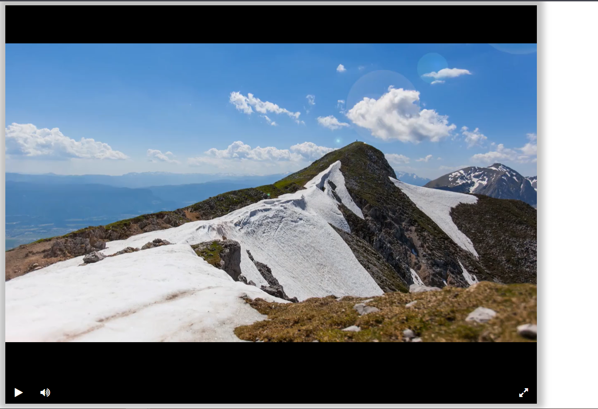

# Видео плеер: Руководство по использованию и документация

## Оглавление

* [Описание проекта](#описание-проекта)
    * [Как это работает?](#как-это-работает)
    * [Предварительные требования](#предварительные-требования)
    * [Установите зависимости](#установите-зависимости)
* [Скрипты проекта](#cкрипты-проекта)
* [Основные скрипты](#основные-скрипты)
    * [main.py](#mainpy)
* [Цель проекта](#цель-проекта)

## Описание проекта

Этот проект позволяет создать свой видео плеер, воспроизводящий видео через ссылку на него.

### Как это работает?

Проект основан на использовании дополнительных интернет ресурсах. Проект позволяет воспроизвести любое видео

### Предварительные требования:

1. Установленный Python версии 3.11 и выше.
2. pip - установщик пакетов Python.
3. Подключение к Интернету (для захода на сайт).

### Установите зависимости

С активированным виртуальным окружением установите зависимости проекта:

```bash
pip install -r requirements.txt
```

## Скрипты проекта:

* [main.py](#mainpy)

## Основные скрипты

### main.py

#### Что делает скрипт?

С помощью этого инструмента мы запускаем документ index.html

#### Как запустить скрипт?

```bash
python main.py
```

Чтобы открыть сайт есть несколько вариантов:

- Вы можете открыть напрямую файл `index.html`

- Вы можете перейти на удалённый сайт на [Github.io](https://nadyad2011.github.io/video-player/)

- Вы можете перейти на локальный сервер по [ссылке](http://127.0.0.1:5500)

#### Что выведет скрипт?

Если все настроено верно, то мы получим сайт схожий с картинки.

Пример вывода :



## Цель проекта

Проект написан в образовательных целях для онлайн курсов Devman.